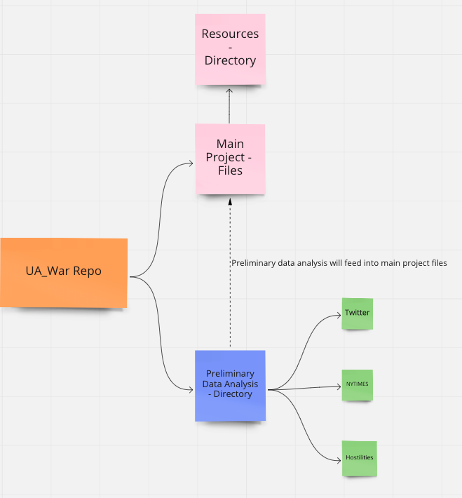

# AIScience-22 Team Git Best Practices and Repo Organization 

## Oraganization of UA_War Repo 

The following outlines how the UA_War project repository is organized. 

1. All premliminary data research and transformation will live in the Preliminary Data Analysis - Directory
2. Main project files that consist of combining the various data set together and machine learning of data will live on the top level of the directory 
3. All support data files (transformed) and images will live in a sub directory under the main Resources directory. 

## Branching Practices 
1. Nameing a branch 
- A branch name should consist of dataset directory name, descriptive word  and version number. Let start it at to tenth decimal point 
- Examples: 
  - twitter_data_cleanup_0.01
  - twitter_machine_learning_0.02

2. All supporting files should be nested under the correct directory 

3. Pushing to GitHub 
- After you have push your current working branch to github. Please slack out that a pull request (PR) is ready for review for your fellow team members. Don't push to main branch directly since it will override all files. 
- Team members who review branch please review for conflicts and leave comments if conflicts can't be resolved so the team original team member can resolve 
- After the working branch has been merged to the main branch please slack out that this is completed and ask other team members to git do a pull. If you are currently working on a working branch it is best to push your current working branch before doing a git pull. It is not recommended that you git pull the new main branch changes to an already working branch. 

4. Creating and submitting Pull Requsts - Please add a descriptions of what the purpose of the branch is and how to test that branch. 

## Submitting Files 

1. Remember to add comments in notebooks and files in order for team members to follow along. 

2. If a longer explanation is necessary please use a readme file. 

3. Please use images when possible in write up to assist in your fellow team members understanding 

